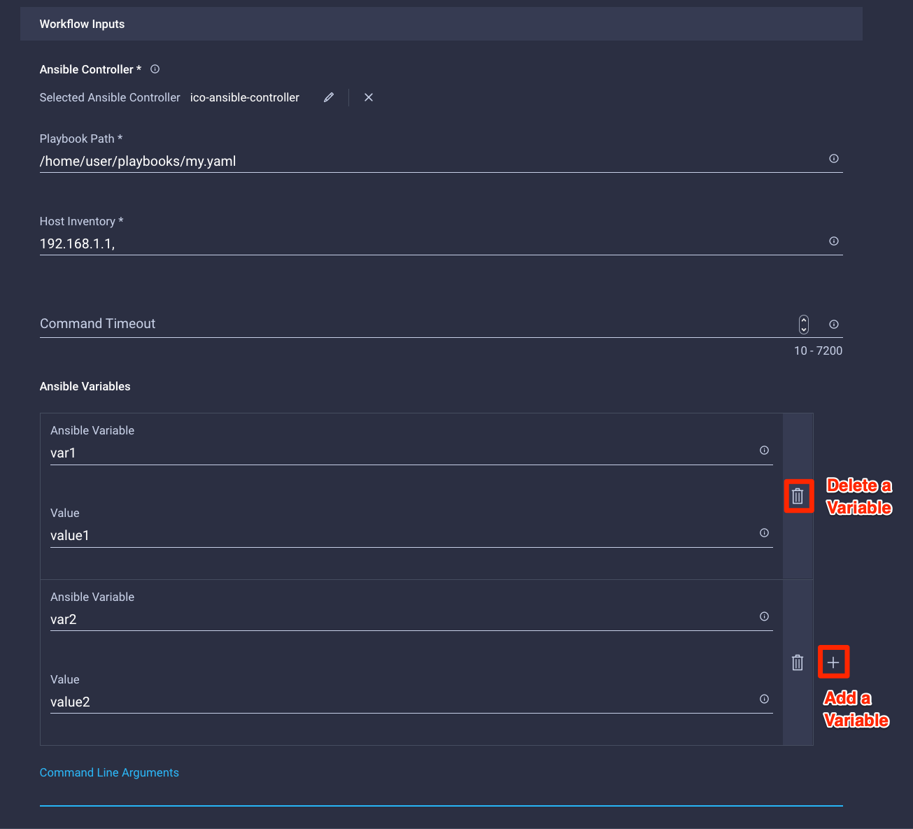

# Intersight Cloud Orchestrator - Execute Ansible Playbook
###### Filename: `Export_Workflow_ExecuteAnsiblePlaybook.json`
###### Category: `Applications, Infrastructure`

## Use Case
This workflow enhances the Ansible Executor in Intersight Cloud Orchestrator (ICO) supporting a new Data Type called `Ansible Variables`.

Users can now use this workflow in larger workflows and easily specify ansible variables instead of going inline as a command line argument.

Additional command line arguments can still be specified.

## Overview
This workflow implements the following automation tasks:

- Invoke Ansible Playbook

By importing, a new `Ansible Variables` data type will also be created.

### Inputs

- Ansible Controller (mandatory)
- Playbook Path (mandatory)
- Host Inventory (mandatory)
- Command Timeout (optional)
- Ansible Variables (optional)
- Command Line Arguments (optional)

### Outputs

- Exit Code
- Execution Summary
- Execution Log Path

## Claimed Targets

- Ansible Controller Node

## Prerequisites

- Target host with working SSH connectivity and the command `ansible-playbook` available.

## Notes

- See [Intersight Help - Ansible Executor](https://intersight.com/help/appliance/resources/Executor_Ansible) for instruictions on how to use the Ansible Executor in ICO
- Visit [ansible-playbook CLI documentation](https://docs.ansible.com/ansible/latest/cli/ansible-playbook.html) for additional details on command line arguments and host inventory

The command line arguments for running the Ansible playbook against the given endpoint.
Escape character backslash(\) needs to be used when the command line arguments contain double quotes(") in them.

The following command line options are not supported by the Ansible playbook task.
1. -vvv
2. -vvvv
3. -k, -K
4. -c
5. --connection
6. --sftp-extra-args
7. --scp-extra-args
8. --ask-vault-password
9. --step

## Screenshots

#### Execution Example

